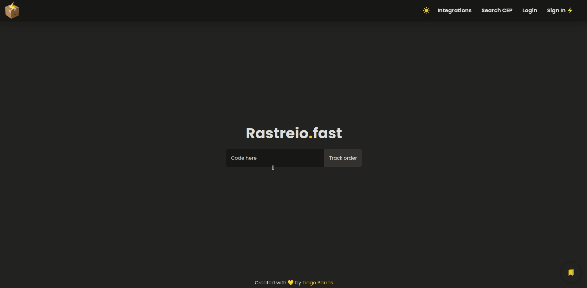

<h1 align="center">
   
  
   
  Rastreio.Fast
 </h1>
 

An app to track your packages!

 
<!-- 

  

 -->

## Features
 - **ReactJs** - A JavaScript library for building user interfaces
 - **Typescript** - A superset of Javascript
 - **Styled-Components** - A lib of styles for React
 - **React-Icons** - A lib of icons on React
 -  _I also used Eslint & Eslint-plugin-import-helpers in development_

## Getting started

**1.** Clone this repo using `git clone` 
**2.** Move yourself to the appropriate directory `cd rastreio.fast` 
**3.** Run `yarn` to install dependencies 
**4.** Run `yarn start` to start the app
 
 
